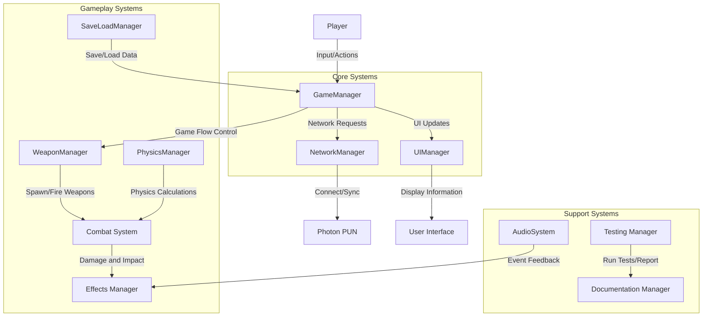
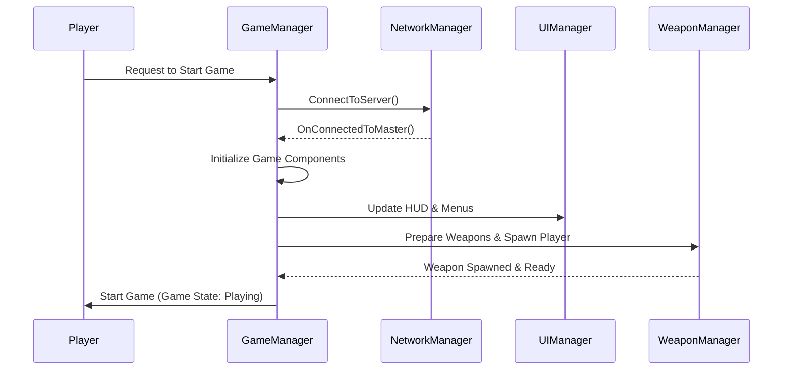

# System Interaction Diagrams

This document contains diagrams illustrating the interactions between the main components of the Arena DeathMatch system and the data flow among them. The diagrams are created using Mermaid syntax. To view the diagrams rendered, you can use any Markdown viewer that supports Mermaid (such as the VS Code Markdown Preview Mermaid extension).

---

## Overview

The Arena DeathMatch system is composed of several core subsystems that work together to provide a seamless multi-player VR experience. The key components are:

- **Core Systems:**  
  - GameManager: Oversees game flow, state management, round progression, and score handling.
  - NetworkManager: Manages all network and multiplayer functionalities using Photon PUN.
  - UIManager: Handles all user interface interactions, HUD updates, and in-game menu navigation.
  
- **Gameplay Systems:**  
  - WeaponManager: Manages weapon spawns, firing, reloading, and effects.
  - PhysicsManager: Centralizes physics settings and collision interactions.
  - SaveLoadManager: Provides game data persistence.
  - Combat & Effects Systems: Include damage handling, recoil, impact effects, and audio/visual feedback.

- **Support Systems:**  
  - AudioSystem: Manages audio playback, spatial sound and event-based audio triggers.
  - Testing and Documentation: Tools for automated tests and statistical reporting via the StatisticalTablesGenerator.

Below are detailed diagrams to illustrate the interactions and data flows between these components.

---

## Diagram 1: High-Level Component Interaction

**Explanation:**  
- The **Player** sends inputs that are managed by the **GameManager**, which coordinates game flow and state transitions.
- **GameManager** communicates with **NetworkManager** to handle multi-player interactions, and with **UIManager** to update HUD and menus.
- **WeaponManager** handles weapon spawning and firing processes, interacting with both **Combat System** and **Effects Manager** for visual and audio feedback.
- Support systems like **AudioSystem** and **SaveLoadManager** work in the background to enhance immersion and preserve game state.

---

## Diagram 2: Sequence Diagram - Game Start Flow

**Explanation:**  
- This sequence diagram shows the order of operations when a player initiates the game start.
- The **GameManager** handles initializing various components, such as triggering a network connection via **NetworkManager** and preparing weapons through **WeaponManager**.
- Finally, the **UIManager** is updated to reflect the game state change, and the player enters the game with all systems active.

---

## Additional Notes

- **Data Flow:**  
  Data flows from user inputs processed by high-level game controllers down to specific subsystems (weapon, physics, audio) which provide real-time feedback. Meanwhile, persistent data (like save files or statistical reports) is managed by dedicated systems that operate independently.

- **Modularity:**  
  The architecture ensures that each system (core, gameplay, and support) can be developed, tested, and maintained independently while interacting through clearly defined interfaces.

- **Extensibility:**  
  New systems (like AI or additional UI modules) can be integrated without disturbing the existing interactions, thanks to the modular design and centralized game state management.

These diagrams serve as a visual reference to understand the interplay between components in our Arena DeathMatch project and can be used to guide further development and troubleshooting.
